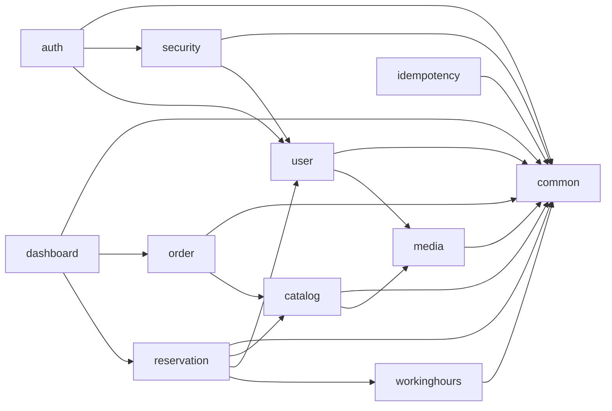

# G-Manager module boundaries

Status: važi od Stage-a 2  
Arhitektonski stil: jedan deployable modularni monolit, package-by-feature.

## Pravila

1. `controller` poziva application/service API, nikada repository.
2. Repository i JPA entitet su privatni persistence detalji feature modula.
   Postojeći statički DTO factory metodi mogu primiti entitet, ali serialized
   DTO članovi i javni povratni tipovi ne smeju izložiti JPA entitet.
3. `common` sadrži samo stabilne cross-cutting contracts, konfiguraciju, error,
   pagination i bazne persistence primitive. Ne zavisi od feature modula.
4. `common.security` je shared identity contract:
   `Role`, `AuthenticatedUser`, `CurrentUserProvider` i
   `SessionRevocationPort`. Ne sadrži JWT, cookie ili repository implementaciju.
5. `security` implementira Spring Security adaptere i sme da čita `user` radi
   potvrde aktivnog naloga. Feature moduli zavise od `common.security`, ne od
   Spring Security implementacije.
6. `auth` implementira login/refresh i `SessionRevocationPort`. `user` ne zavisi
   od `auth`, čime je uklonjen prethodni ciklus.
7. Cross-module zavisnost mora pratiti graf ispod. Nova povratna zavisnost koja
   pravi ciklus zahteva facade/port i ADR, ne ArchUnit izuzetak.
8. Transakcione poslovne granice ostaju u servisima/application writer-ima.
9. Frontend stranice pristupaju mreži samo kroz `src/api`. Direktan `axios`
   import van tog direktorijuma je ESLint greška.
10. Frontend `types` su transportni ugovori; page/layout komponente ne kreiraju
    zasebne HTTP klijente.

## Trenutni dependency graf



Graf je usmeren i bez ciklusa. ArchUnit ga proverava na nivou prvog paketa ispod
`com.game_manager.gm`.

## Javni cross-module contracts

| Contract | Vlasnik | Potrošači | Namena |
|---|---|---|---|
| `Role`, `AuthenticatedUser` | `common.security` | svi role-aware moduli | Stabilan identitet bez Spring Security zavisnosti |
| `CurrentUserProvider` | `common.security` | feature servisi | Port za trenutno autentifikovanog korisnika |
| `SessionRevocationPort` | `common.security` | `user`; implementira `auth` | Opoziv sesija bez `user → auth` zavisnosti |
| `FileStorageService` | `media` | `user`, `catalog` | Storage port za slike |
| `CatalogService#getActiveById` | `catalog` | `order`, `reservation` | Validiran aktivni item lookup |
| `WorkingHoursService#validateWithinWorkingHours` | `workinghours` | `reservation` | Poslovna availability politika |
| Agregatne metode `OrderService`/`ReservationService` | njihovi moduli | `dashboard` | Read-only dashboard projections |

Poslednja tri contract-a su postojeći service facade-i. Ako njihov API poraste
izvan nekoliko stabilnih use-case metoda, izdvajaju se zasebni port/facade
interfejsi u vlasničkom modulu; ne pomeraju se u `common`.

## Backend automatske provere

`ModuleArchitectureTest` proverava:

- da top-level module slices nemaju cikluse;
- da controller ne zavisi od repository-ja;
- da DTO ne zavisi od repository-ja;
- da DTO javni izlazni contract ne izlaže JPA entitet.

Komanda:

```powershell
cd gm
.\mvnw.cmd -Dtest=ModuleArchitectureTest test
```

## Frontend granice

```text
pages/layout/auth/catalog/... ──> api ──> axios
             │                    │
             ├──> types           └──> types/auth store
             └──> common
```

`eslint.config.js` zabranjuje `axios` import u svim `src` fajlovima osim
`src/api/**/*`. Feature page koristi odgovarajući `*Api.ts`; shared transport,
refresh i error ponašanje ostaju u `api/client.ts`.

## Proces promene granice

1. Dodati use case vlasničkom modulu.
2. Ako potrošač zahteva samo mali stabilni contract, izložiti facade/port.
3. Implementacija i repository ostaju u vlasničkom modulu.
4. Pokrenuti ArchUnit i frontend lint.
5. Ako promena namerno menja smer grafa, dodati ADR i ažurirati ovaj dijagram.
   Ignorisanje dependency-ja u ArchUnit testu nije trajno rešenje.
