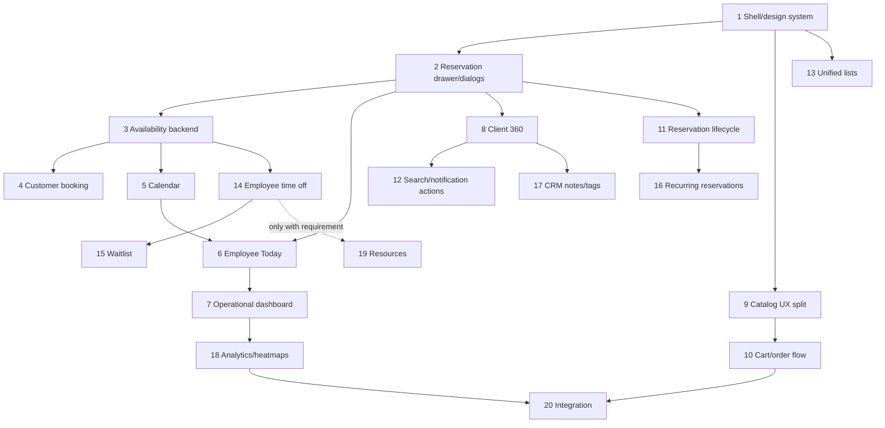

# G-Manager product/UX upgrade roadmap

Status: `ACTIVE`  
Datum analize: 2026-08-11  
Opseg: evolucija postojećeg modularnog monolita; bez rewrite-a, multi-tenancy-ja, mikroservisa ili paralelne arhitekture.

## Repository-wide baseline

Backend već ima Spring Boot modularni monolit, MySQL/Flyway V1-V23, H2 test profil, typed konfiguraciju, JWT/refresh sesije, permission/capability model, audit, idempotency, optimistic locking, outbox/jobs, feature flags, pretragu, dashboard, dokumente, izveštaje, workflow i observability. Reservation servis već autoritativno proverava aktivnu uslugu/zaposlenog, trajanje, radno vreme, preklapanje, zaključavanje zaposlenog i lifecycle. Order servis čuva stvarne stavke i server-side cene. Ovo se proširuje kroz postojeće module i facade-e; ne duplira se.

Frontend već ima React Router, Zustand session/feature state, TanStack Query, centralni API sloj, URL list state, optimistic/idempotency podršku, Drawer/Modal/toast/skeleton/error/empty komponente, SavedViewBar, SelectionBar, CommandPalette, NotificationCenter, theme/density, PWA i Playwright/axe. Glavni jaz je product information architecture: ravna navigacija, isti početni UX za sve role, backend-oriented liste/raw UUID prikazi, ručni booking datum, nepostojanje kalendara i native prompt/confirm dijalozi.

Customer je trenutno `User` sa rolom `CUSTOMER`; nema dokaz potrebe da se authentication identity odvaja. CRM podatke treba držati u malom zasebnom customer-profile agregatu tek kada Stage 8/17 uvede stvarne atribute. Room/equipment resursi nisu dokazani postojećim domenom i Stage 19 je uslovni no-go dok se ne pojavi poslovni zahtev.

## Dependency graph

## Stage plan

### Stage 1 — UX/design-system foundation and role-aware navigation

- Goal: grouped desktop sidebar, responsive Drawer and role-specific home/navigation based on existing capabilities and flags.
- Backend/database/API: no change; current permission payload remains authoritative.
- Frontend: navigation model, grouped shell, semantic layout/status tokens, focused mobile behavior, route/home metadata and component tests.
- Tests: role/permission/flag navigation matrix, component accessibility, existing responsive E2E.
- Acceptance: customer sees only customer tasks; employee sees operational-first links; management sees grouped workspace; inaccessible links are absent; theme/density/keyboard/focus remain functional.
- Risk: frontend filtering is not authorization; backend guards remain unchanged.
- Existing reuse: capability model, Drawer, CommandPalette, NotificationCenter, preferences and tokens.

### Stage 2 — Reservation details and reusable action dialogs

- Goal: one accessible details Drawer shared by list, dashboard, calendar and Today surfaces; remove reservation native prompts/confirms.
- Backend/API: add permission-scoped reservation detail projection only for missing human-readable customer/service/employee/history fields; reuse transition service.
- Database: no schema change unless audit projection proves insufficient.
- Frontend: drawer, state-aware actions, confirm/reason modal primitives, deep-link state.
- Tests/acceptance: foreign detail hidden, capability/state matrix, focus trap/return, no raw UUID as primary content.
- Risk: avoid leaking customer contact to roles lacking permission.

### Stage 3 — Availability backend foundation

- Goal: authoritative day/range slot API shared by booking and calendar.
- Backend/API: typed availability query, business-zone conversion, service duration, working-hour exceptions, employee filtering and overlap reuse from reservation policy.
- Database: add only measured range indexes; no availability shadow table.
- Tests: DST, overnight hours, holidays, overlap boundaries, inactive employee/service, concurrency revalidation.
- Acceptance: every returned slot is valid under create rules; create still independently rejects stale slots.

### Stage 4 — Customer slot-based booking

- Goal: replace `datetime-local` with service → employee/any → date → slot → note → review → confirmation.
- Backend/API: use Stage 3; optional “any employee” resolves deterministically and locks at create.
- Database: none unless idempotency contract requires forward migration.
- Frontend/tests: step flow, loading/empty/conflict/retry, keyboard and mobile tests; preserve idempotency.
- Acceptance: customer books only a real slot and receives actionable conflict recovery.

### Stage 5 — Calendar/Scheduler

- Goal: real day/week/month and employee-oriented reservation calendar.
- Backend/API: permission-scoped range projection with human-readable labels and bounded date windows.
- Database: verify composite employee/start/status index with MySQL EXPLAIN.
- Frontend/tests: responsive calendar, semantic status tokens, details Drawer, timezone/DST and range navigation.
- Acceptance: calendar matches repository data and never computes critical availability locally.

### Stage 6 — Employee Today workspace

- Goal: primary employee landing page for today’s appointments, gaps, assigned/unclaimed orders and attention notifications.
- Backend/API: bounded “today” projection using authenticated employee and business timezone.
- Database: reuse reservation/order indexes; add only proven query index.
- Tests: employee isolation, midnight/DST, action capabilities and empty day.
- Acceptance: employee completes normal daily work without analytics navigation.

### Stage 7 — Operational dashboard / Needs attention

- Goal: add actionable current-state overview above retained analytics.
- Backend/API: today counts, pending/cancelled, next appointments, order attention and workload thresholds with explicit semantics.
- Database: aggregate projections only; performance budget and EXPLAIN.
- Tests: metric definitions, drill-down links/filters, role scope and accessible chart/table fallback.
- Acceptance: every attention item links to an authorized actionable view.

### Stage 8 — Customer/Client 360 domain and UI

- Goal: management customer list/detail with reliable history and computed KPIs.
- Backend/API: customer projection/facade over User, reservations and orders; introduce minimal profile table only for non-auth business attributes.
- Database: customer history indexes and optional `customer_profiles` forward migration.
- Tests: permission isolation, revenue semantics, pagination/N+1 and customer with no history.
- Acceptance: no invented phone/visit/CRM data and no auth-model split without need.

### Stage 9 — Customer/management catalog separation

- Goal: simple browse/choose experience for customers and dense administration workspace for managers.
- Backend/API: retain catalog contracts; add only missing customer filters/projections.
- Frontend/tests: distinct composition by capability, service booking CTA, product cart CTA, management dialogs and bulk tools.
- Acceptance: customers never see management chrome; managers retain all current operations.

### Stage 10 — Real cart/order flow

- Goal: persistent client cart UX with server-authoritative checkout and order review.
- Backend/API: validate active products, price snapshot and totals; retain idempotency.
- Database: extend order model only for explicitly required checkout metadata.
- Tests: price change, inactive item, quantity, duplicate submit, conflict and recovery.
- Acceptance: no fake cart action; every order persists through existing order service.

### Stage 11 — Reservation lifecycle extension

- Goal: explicit transition policy and state-aware management/customer actions.
- Backend/API: central transition graph, reason rules and action capabilities in detail DTO.
- Database: append-only transition history only if audit cannot provide required business timeline.
- Tests: full allowed/forbidden matrix, optimistic locking and temporal cutoff.
- Acceptance: UI renders server-supported actions and backend rejects every illegal transition.

### Stage 12 — Notification and Command Palette entity actions/search

- Goal: actionable notifications and permission-aware navigation/search over real entities.
- Backend/API: extend existing search/notification projections with stable action/deep-link metadata.
- Database: reuse search preferences/notifications; indexes only after measured query.
- Tests: no unauthorized result/action, stale target, keyboard palette and notification recovery.
- Acceptance: no client-generated privileged action metadata.

### Stage 13 — Unified management list patterns

- Goal: consistent filters, saved views, selection, bulk outcomes, pagination and row details across management pages.
- Backend/API: normalize only inconsistent pagination/bulk contracts.
- Database: no generic list tables; reuse saved views.
- Tests: URL restoration, partial bulk failure, mobile table/card alternative and focus.
- Acceptance: existing specialized workflows remain intact while shared mechanics converge.

### Stage 14 — Employee time-off / availability

- Goal: management of employee-specific working exceptions consumed by availability.
- Backend/API: scoped time-off aggregate, overlap policy, audit and availability integration.
- Database: forward migration with employee/range/status indexes and optimistic version.
- Tests: overlap, authorization, DST, cancellation and slot exclusion.
- Acceptance: approved time off removes slots and pending/rejected requests do not.

### Stage 15 — Waitlist

- Goal: customer opt-in when no slots exist, with safe offer/expiry workflow.
- Backend/API: waitlist state machine, matching job, notification and idempotent acceptance.
- Database: waitlist entries/offers with unique active constraints.
- Tests: ordering, concurrent offer acceptance, expiry, privacy and notification retry.
- Acceptance: waitlist cannot create a reservation without final create-time availability validation.

### Stage 16 — Recurring reservations

- Goal: explicit recurrence proposal creating individually validated reservations.
- Backend/API: bounded recurrence rule, preview, partial-conflict policy and idempotent batch creation.
- Database: recurrence series link only; reservations remain source of truth.
- Tests: DST/month boundaries, partial conflicts, cancellation scope and limits.
- Acceptance: no unbounded generation or bypass of slot rules.

### Stage 17 — CRM notes/tags

- Goal: minimal auditable management notes/tags attached to customers.
- Backend/API: dedicated customer CRM aggregate with permission/retention rules.
- Database: normalized notes/tags relations; never store auth secrets or unrestricted blobs.
- Tests: authorization, audit, optimistic updates, search and retention.
- Acceptance: CRM state is separate from User identity and based on real entered data.

### Stage 18 — Advanced analytics/heatmaps

- Goal: demand weekday × time-bucket heatmap and improved operational analytics from real reservations/orders.
- Backend/API: defined aggregation semantics, bounded periods and timezone buckets.
- Database: measured covering indexes/materialization only if live query misses budget.
- Tests: bucket boundaries, DST, empty data, role scope, accessible table and performance.
- Acceptance: no attendance/overtime/team metric without a domain source.

### Stage 19 — Resource scheduling, conditional

- Entry gate: written evidence of room/equipment constraints from product/domain documentation. Current decision: `NO-GO`.
- If approved: model resources, eligibility and conflicts as a separate module integrated with Stage 3 availability.
- Tests: employee/resource atomic locking, conflicts and rollback.
- Acceptance: otherwise document extension port only and introduce no generic tables/UI.

### Stage 20 — Final integration and hardening

- Goal: complete role journeys, accessibility, performance, cleanup and current documentation.
- Backend/database: MySQL migration upgrade/fresh tests, query budgets, security matrix and no N+1.
- Frontend: remove remaining native prompts, mojibake/raw UUID primary UI, responsive/a11y/zoom/reduced-motion regression.
- Tests: full backend/frontend, MySQL, role E2E, concurrency, Playwright/axe, performance and production build.
- Acceptance: OWNER/ADMIN/EMPLOYEE/CUSTOMER completion criteria from the product specification all pass.

## Execution rules

Each stage is a complete vertical slice where persistence/API changes are needed. Existing mechanisms are preferred over new abstractions. Frontend capability checks shape UX but never replace backend authorization. Old Flyway files remain unchanged; corrections are forward-only. Stage documentation records actual tests and blockers. Full-suite validation runs once at each stage boundary; focused tests are used during implementation.
