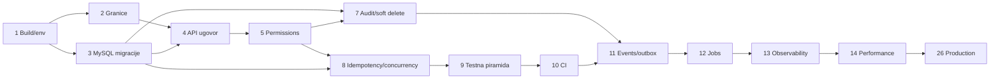
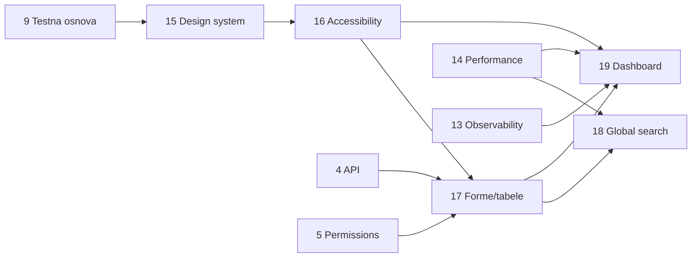
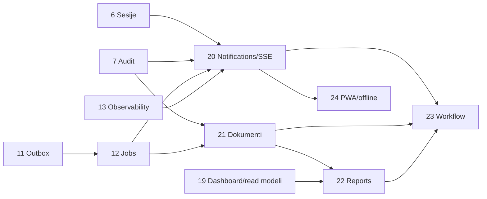
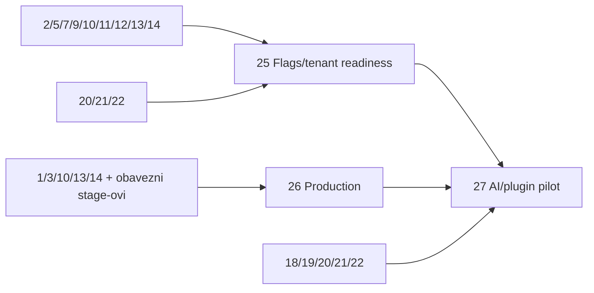

# G-Manager — mapa zavisnosti stage-ova

Autoritativni detaljan obim je u `MASTER_IMPLEMENTATION_ROADMAP.md`. „Paralelno“
znači da stage može deliti kalendarski period nakon zajedničkih preduslova, ali
izmene istih fajlova i migracioni redosled i dalje moraju biti koordinisani.

## Tabela zavisnosti

| Stage | Direktne zavisnosti | Direktno blokira | Paralelizacija | Breaking change | Data migracija | Deployment promena |
|---:|---|---|---|---|---|---|
| 1 | — | 2, 3, 9, 10 | Ne; početni baseline | Ne | Ne | Local/dev |
| 2 | 1 | 4, 5, 11, 25 | Može sa 3 | Interni samo | Ne | Ne |
| 3 | 1 | 4, 7, 8, 9, 11, 14 | Može sa 2 | Ne | Moguća korektivna | Test/CI DB |
| 4 | 2, 3 | 5, 17 | Ograničeno sa 7 | Aditivni error model | Ne | OpenAPI policy |
| 5 | 2, 4 | 6, 7, 8, 18, 20, 21 | Ne; security kapija | Security correction moguća | Uslovno | Ne |
| 6 | 5 | 20 | Može sa 8 | Ne | Da | Ne |
| 7 | 3, 5 | 11, 18, 20, 21, 23, 25 | Može sa 8 posle 5 | Semantika delete/list | Da | Retention kasnije |
| 8 | 3, 4, 5 | 9, 24 | Može sa 6/7 | Key scope correction | Da | Ne |
| 9 | 3, 4, 5, 8 | 10, 15, 24 | Ne; test kapija | Ne | Ne | E2E test env |
| 10 | 1, 3, 9 | 11, 13, 14, 26 | Ne; automation kapija | PR policy | Ne | CI artifacts |
| 11 | 2, 3, 7, 8, 10 | 12, 20, 23 | Ne | Interni event contract | Da | Worker process/config |
| 12 | 11 | 13, 20, 22, 23 | Može sa ranim 15 | Ne | Da | Scheduler/worker |
| 13 | 10, 11, 12 | 14, 19, 20, 21, 26 | Može sa 15 | Management exposure | Ne | Ops stack/probes |
| 14 | 3, 10, 13 | 18, 19, 22, 25, 26 | Može sa 16 | Uslovno pagination | Uslovni indeksi | Perf environment |
| 15 | 9 | 16, 17, 19, 20 | Može sa 11–13 | Vizuelni | Ne | Ne |
| 16 | 15 | 17, 19, 20 | Može sa 14 | Ne | Ne | A11y CI |
| 17 | 4, 5, 15, 16 | 18, 19 | Ne | Ne | Da za saved views | Ne |
| 18 | 5, 14, 17 | 19 opcionalno | Može sa 20/21 | Ne | Uslovni indeksi + prefs | Ne |
| 19 | 5, 13, 14, 15, 16, 17 | 22 | Može sa 20/21 | Ne | Da za prefs/indekse | Ne |
| 20 | 5, 6, 7, 11, 12, 13, 15, 16 | 22, 23, 24 | Može sa 18/19/21 | Ne | Da | SSE/email config |
| 21 | 5, 7, 11, 12, 13 | 22, 23 | Može sa 18–20 | Media URL prelaz | Da + file copy | Object storage/scanner |
| 22 | 12, 13, 14, 19, 21 | 23, 27 | Ne | Ne | Da | Renderer/storage |
| 23 | 5, 7, 11, 12, 13, 20, 21, 22 | 25 opcionalno | Ne | Uslovno | Da | Worker/config |
| 24 | 8, 9, 15, 16, 17, 20 | 26 | Može posle API stabilnosti | Cache contract aditivan | Uslovno | SW/CSP |
| 25 | 2, 5, 7, 9, 10, 11, 12, 13, 14, 20, 21, 22 | 27 | Ne ako tenant deo | Potencijalno veliki | Potencijalno sve tabele | Multi-instance/secrets |
| 26 | 1, 3, 10, 13, 14, svi implementirani obavezni/feature stage-ovi | 27 production rollout | Završna konsolidacija | HTTPS/runtime config | Migration gate | Da, primarni obim |
| 27 | 5, 7, 10, 11, 12, 13, 14, 18, 19, 20, 21, 22, 26 | — | Tek kao izolovan pilot | Ne | Minimalna metadata | Provider/kill switch |

## Kritični put

Minimalni put do produkcijske spremnosti je:

`1 → 2/3 → 4 → 5 → 8 → 9 → 10 → 11 → 12 → 13 → 14 → 26`

UX quality put koji mora biti završen pre punog produkcionog review-a je:

`9 → 15 → 16 → 26`

Stage 7 je paralelna obavezna kapija pre event-driven i budućih osetljivih
funkcija: `3 + 5 → 7 → 11`.

## Stage-ovi sa najvećim blokirajućim uticajem

1. **Stage 5** — permission/resource model blokira audit, search, notification,
   dokumente, multi-tenancy i svaki permission-sensitive prikaz.
2. **Stage 9/10** — bez testne i CI kapije nije bezbedno širiti sistem.
3. **Stage 11/12** — pouzdani events/jobs blokiraju notification/report/workflow.
4. **Stage 13/14** — observability/performance dokaz blokira production rollout.
5. **Stage 15/16** — shared UX/a11y temelj blokira dosledne napredne stranice.

## Migracione zavisnosti

- Stage 3 uspostavlja pravi MySQL migration gate za sve kasnije migracije.
- Stage 5 eventualno seed-uje permissions pre Stage 7 audit policy-ja.
- Stage 7 audit i delete semantika prethode events/notifikacijama/dokumentima.
- Stage 11 outbox prethodi Stage 12 jobovima i Stage 20/22/23 consumerima.
- Stage 21 storage metadata prethodi report outputs i workflow attachmentima.
- Stage 25 tenant migracija, ako je odobrena, mora obuhvatiti sve prethodno
  nastale tabele; zato je kasna i višedeploymentna.
- Stage 26 izvodi svaku migration sekvencu u staging-u i vezuje je za backup/
  restore i kompatibilni rollback.

## Deployment zavisnosti

- Stage 10 proizvodi CI artefakte, ali ih ne deploy-uje.
- Stage 11–12 uvode worker/scheduler lifecycle i zahtevaju single/multi-instance
  claim konfiguraciju.
- Stage 13 uvodi Prometheus/Grafana/probes.
- Stage 20 uvodi SSE proxy timeout/connection zahteve i email tajne.
- Stage 21 uvodi object storage/scanner.
- Stage 22 može zahtevati PDF renderer/font pakete.
- Stage 24 uvodi service worker/CSP/cache rollout.
- Stage 26 konsoliduje sve aktivne zavisnosti u staging/production.

## Mermaid — temelj i kritični put

## Mermaid — UX i produktivnost

## Mermaid — asinhrone funkcije i sadržaj

## Mermaid — skaliranje i opcioni horizont

## Dozvoljeni paralelni tokovi

- Posle Stage 1: Stage 2 i 3.
- Posle Stage 5: Stage 6, 7 i 8 uz koordinaciju migracija/security fajlova.
- Posle Stage 10: event/ops tok (11–14) i UX tok (15–16) mogu delimično
  paralelno.
- Posle Stage 17 i ops temelja: Stage 18, 19, 20 i 21 mogu raditi kao odvojeni
  feature tokovi, ali dele permissions, audit i frontend shell.
- Stage 22 zahteva završene 19 i 21; Stage 23 zahteva 20–22.

## Pravilo za preskakanje opcionih stage-ova

Stage 23–25 i 27 mogu ostati neizvršeni. Stage 26 tada konsoliduje samo stvarno
implementirane feature-e, ali ne sme preskočiti nijedan njegov direktni
obavezni security, test, observability, performance ili backup preduslov.
