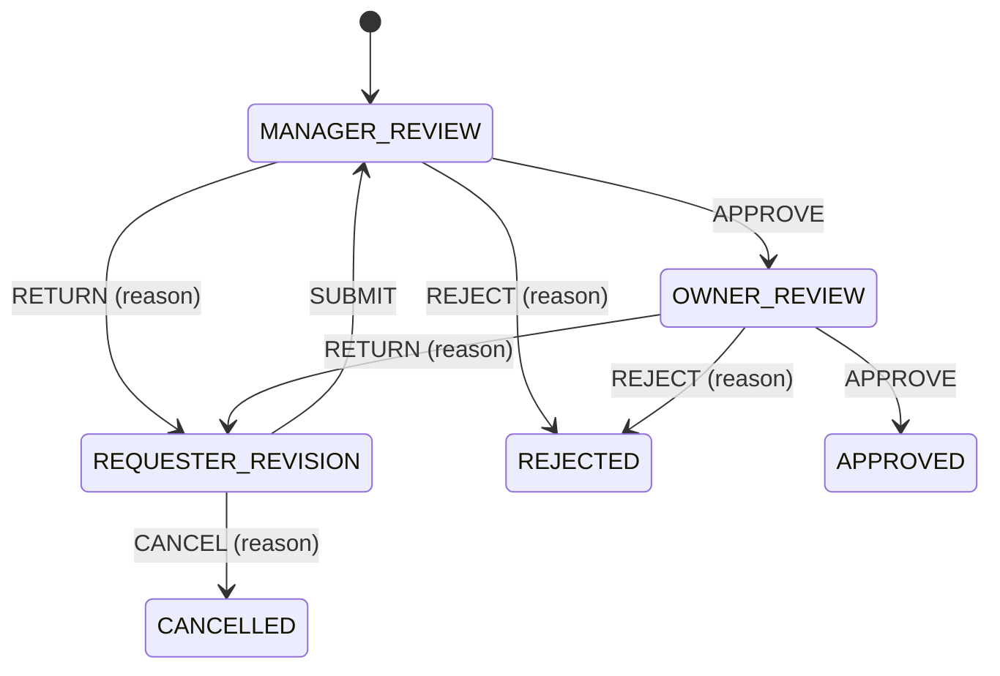

# Stage 23 — Approval workflow i poslovna automatizacija

## Pilot use case

Stage uvodi izolovani proces odobravanja internog troška. Zaposleni podnosi zahtev, administrator ga proverava, a vlasnik donosi konačnu odluku. Zahtev se može vratiti podnosiocu na dopunu. Postojeće order i reservation state machine nisu menjane i workflow ne izvršava proizvoljan kod.

## Model i definicija

Flyway V21 dodaje definition, immutable definition version, instance, step, decision, comment i document-link tabele sa indeksima za inbox i SLA obradu. Verzija čuva ograničenu JSON šemu koraka, uloga, rokova i tranzicija. Validator dozvoljava samo poznate primitive i proverava jedinstvenost i reference. Nova verzija utiče samo na buduće instance; nema retroaktivnog prebacivanja niti BPMN dizajnera.

## Sigurnost i konkurentnost

- `WORKFLOW_SUBMIT`: EMPLOYEE, ADMIN i OWNER; kreiranje i sopstveni zahtevi.
- `WORKFLOW_ACT`: ADMIN i OWNER; odluka samo za dodeljeni aktivni korak.
- `WORKFLOW_MANAGE`: ADMIN i OWNER; objava verzionisane definicije.
- Odluka zaključava instancu i proverava optimistic verziju. Paralelne odluke daju jednog pobednika, dok druga dobija HTTP 409.
- Decisions i audit events su append-only. Timeline sadrži korake, odluke, komentare i povezane Stage 21 dokumente.
- Attachment pristup imaju podnosilac, trenutni assignee i workflow manager.

## SLA, notifikacije i metrike

Rokovi su `Instant` vrednosti dobijene dodavanjem proteklih sati, pa DST ne menja rezultat. Worker šalje idempotentni reminder i posle roka jednom eskalira korak. Fixed Clock test pokriva DST granicu. In-app/SSE notifikacije postoje za assignment, reminder, escalation i completion. Micrometer prati started, completed/rejected i SLA reminder/escalation događaje, bez sadržaja komentara.

## API i korisnički tok

- `GET/POST /api/v1/workflows/definitions`
- `POST /api/v1/workflows`
- `GET /api/v1/workflows/inbox` i `/mine`
- `GET /api/v1/workflows/{id}`
- `POST /api/v1/workflows/{id}/actions`
- `POST /api/v1/workflows/{id}/comments`
- `POST /api/v1/workflows/{id}/documents`

Frontend ruta `/workflows` prikazuje podnošenje, inbox, sopstvene zahteve, rok/eskalaciju i immutable timeline. Server vraća `allowedActions`; razlog je obavezan za reject/return/cancel. HTTP 409 upućuje korisnika na osvežavanje.

## Admin runbook

1. OWNER ili ADMIN objavljuje pilot definiciju na Workflow stranici; ponovna objava pravi sledeću verziju.
2. EMPLOYEE kreira zahtev, ADMIN ga obrađuje, zatim OWNER donosi konačnu odluku.
3. Za zastoj proveriti `workflow_steps.due_at`, `reminded_at`, assignee polja, workflow SLA metrike i notification zapise.
4. Objavljeni `schema_json`, decisions i audit se ne menjaju ručno. Ispravke se rade novom verzijom definicije ili novom forward-only Flyway migracijom.

## Verifikacija

Testovi pokrivaju validator, permission/transition matricu, obavezan razlog, vidljivost, audit, pilot tok, paralelnu odluku, SLA/DST i OpenAPI ugovor. Frontend test pokriva dostupno prazno stanje i podnošenje zahteva.
